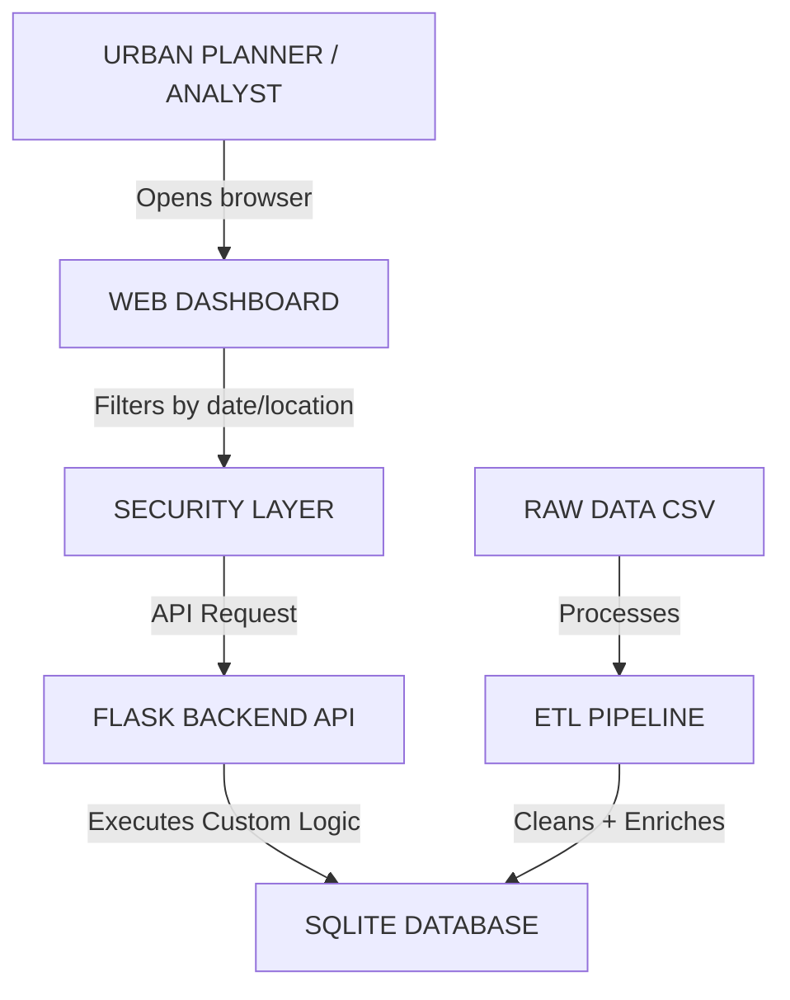

# Urban Taxi Mobility Analyst

A comprehensive urban mobility data exploration platform designed to analyze and visualize NYC Taxi trip data. The system provides insights into mobility patterns, identifies coverage gaps, detects system anomalies, and analyzes rush hour trends through a high-performance backend and an interactive frontend dashboard.

## Architecture Philosophy

Our architecture follows a user-centric, insight-driven design that transforms raw urban mobility data into actionable intelligence. The system is built around three core principles:

- **User Experience First**: Dashboard-centered design enabling urban planners to explore patterns intuitively.
- **Data Integrity**: Rigorous ETL pipeline ensuring clean, validated, and enriched data.
- **Security & Performance**: Multi-layer security with optimized queries for real-time analytics.

## Data Flow (User Journey)



## Project Structure

```text
taxi_sumtv/
├── backend/
│   ├── dal/
│   │   ├── init_db.py          # Database initialization
│   │   └── trip_dal.py         # Data Access Layer
│   ├── etl/
│   │   ├── features/
│   │   │   └── feature_engineer.py
│   │   ├── ingestion/
│   │   │   └── loaders.py
│   │   ├── processing/
│   │   │   └── cleaner.py
│   │   └── pipeline.py         # ETL Orchestrator
│   ├── logic/
│   │   ├── aggregators.py      # SQL Business Logic
│   │   └── algorithms.py       # Custom DSA ranking
│   ├── security/
│   │   ├── auth_logic.py       # Password hashing/Tokens
│   │   └── validator.py        # Request validation
│   └── run.py                  # Main Flask entry point
├── data/
│   ├── yellow_tripdata_2019-01.csv
│   ├── taxi_zone_lookup.csv
│   └── taxi_zones/
│       ├── taxi_zones.shp     # Spatial data
├── database/
│   ├── schema.sql
│   └── taxi_data.db            # SQLite Storage
├── frontend/
│   ├── app.js                  # Frontend logic
│   ├── dashboard.html          # Main Dashboard UI
│   ├── index.html              # Login page
│   ├── signup.html             # Signup page
│   └── style.css               # Stylesheet
└── README.md
```

## System Architecture

### Layer 1: User Interface (Frontend)
- **Interactive Dashboard**: Main exploration interface with filters for Boroughs and Zones.
- **Map Visualization**: Renders taxi zones with GeoJSON polygons using Leaflet.js.
- **Charts Engine**: Time-series trends and peak hour analysis using Chart.js.
- **Filter Controls**: Dynamic selectors for spatial and temporal data.

### Layer 2: Security Layer
- **Input Sanitization**: Backend validation via `validator.py` to prevent malformed requests.
- **CORS Policy**: Configured to allow secure interaction between the frontend and backend.
- **SQL Parameterization**: Using SQLite's parameterized queries to prevent SQL injection.
- **Auth Logic**: Secure password hashing and token-based session management.

### Layer 3: Application Layer (Backend)
- **REST API**: Flask-based endpoints for trip summaries, hourly activity, and coverage gaps.
- **Data Access Layer (DAL)**: Abstracted interface for all database interactions.
- **Business Logic**: Custom aggregators in `aggregators.py` for complex mobility metrics.

### Layer 4: Storage Layer (Database)
- **SQLite3**: Chosen for portability and ease of setup in a diagnostic environment.
- **Normalized Schema**: Fact-and-dimension structure for optimized query performance.

### Layer 5: ETL Pipeline (Background Processing)
- **Ingestion**: Loading raw CSV records and Shapefile spatial data.
- **Cleaning**: Filtering invalid records (e.g., negative distances, impossible speeds) via `cleaner.py`.
- **Feature Engineering**: Calculating derived metrics like average speed and duration.

## Key Features

- **Interactive Spatial Map**: Visualize taxi zones and mobility hot-spots using Leaflet.js.
- **Real-time Analytics**: Dynamic dashboard with metrics on trip volume, passenger counts, and average speeds.
- **Coverage Gap Analysis**: Identification of underserved areas using drop-off to pick-up ratios.
- **Rush Hour Trends**: Hourly activity visualization to identify peak congestion periods.
- **Diagnostic Reporting**: Comprehensive system health monitoring and anomaly detection.
- **Secure Authentication**: User login and signup system with hashed password storage.

## Technology Stack

- **Backend**: Python, Flask, Flask-CORS, SQLite3, Pandas, NumPy.
- **Frontend**: HTML5, Vanilla CSS, JavaScript (ES6+), Leaflet.js (Mapping), Chart.js (Data Visualization).
- **Data Processing**: Custom ETL pipeline with automated cleaning and feature engineering.

## Data Structures and Algorithms (DSA)

The project implements custom algorithms to optimize data processing and provide advanced insights:

- **QuickSort Implementation**: A manual QuickSort algorithm is used to rank taxi zones by coverage gap ratios and other performance metrics without relying on built-in library sorting.
- **Anomaly Detection**: Custom logic to identify "System Noise" (impossible speeds) and "Economic Noise" (suspicious fare-to-distance ratios).
- **Supply-Demand Balancing**: Algorithmic identification of supply-demand imbalances in urban zones to pinpoint underserved neighborhoods.

## Key Insights to Derive

- **Insight 1: Rush Hour Congestion Patterns**: Identifying how trip speeds drop significantly during peak hours in specific boroughs.
- **Insight 2: Tipping Behavior Analysis**: Understanding geographic tipping patterns (e.g., higher tip ratios in Manhattan vs. others).
- **Insight 3: Supply-Demand Gaps**: Pinpointing zones where drop-off demand vastly exceeds pickup supply, signaling underserved areas.

## Design Decisions & Trade-offs

- **SQLite vs. PostgreSQL**: SQLite was chosen for this version to ensure zero-configuration setup for portability.
- **Vanilla JS vs. Frameworks**: Vanilla JS was used to keep the frontend lightweight and avoid build-step overhead.
- **Server-Side Aggregation**: All heavy calculations are performed in SQL/Python to keep the frontend responsive.

## How to Run

### 1. Backend Setup
Initialize the database and start the Flask server:
```bash
python backend/run.py
```
The server will run on http://127.0.0.1:5000.

### 2. Run ETL Pipeline
To process the raw data and populate the database (if not already done):
```bash
python backend/etl/pipeline.py
```

### 3. Frontend Access
Open `frontend/index.html` in a web browser or serve it through the Flask server by visiting http://127.0.0.1:5000.

## Unexpected Observation

During development, we observed that ~5% of recorded trips had an average speed exceeding 100 mph, likely due to GPS noise. This led to the implementation of the **Custom Anomaly Detection** layer in the ETL pipeline to filter such records for higher data integrity.

## Future Enhancements
- **Spatial Clustering**: Using ML to auto-group high-demand zones.
- **Real-time Streaming**: Integrating live NYC Open Data feeds.
- **Predictive Analytics**: Forecasting next-day demand using historical trends.
